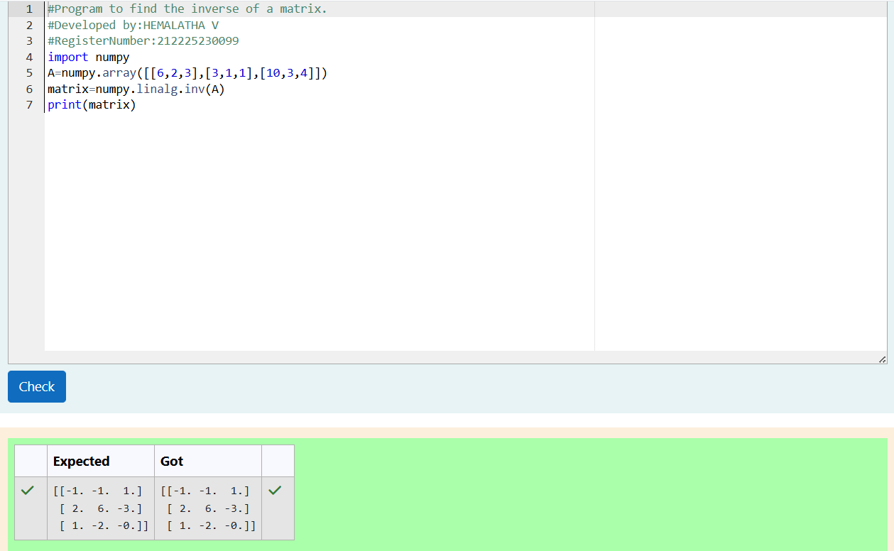

# INVERSE-OF-A-MATRIX
## Aim:
To write a python program to find the inverse of a matrix

## Equipment’s required:
1. 	Hardware – PCs
2. 	Anaconda – Python 3.7 Installation / Moodle-Code Runner

## Algorithm:
### Step1 :
Import the numpy module to use the built-in functions for calculation

### Step 2:
Prepare the lists from each linear equations and assign in np.array()

### Step 3:
Using np.linalg.inv(),we can find the inverse of a matrix

### Step 4:
End the program

## Program:
~~~

#Program to find the inverse of a matrix.
#Developed by:HEMALATHA V 
#RegisterNumber:212225230099
import numpy
A=numpy.array([[6,2,3],[3,1,1],[10,3,4]])
matrix=numpy.linalg.inv(A)
print(matrix)

~~~

## Output:

## Result:
Thus the inverse of given matrix is successfully solved using python program

